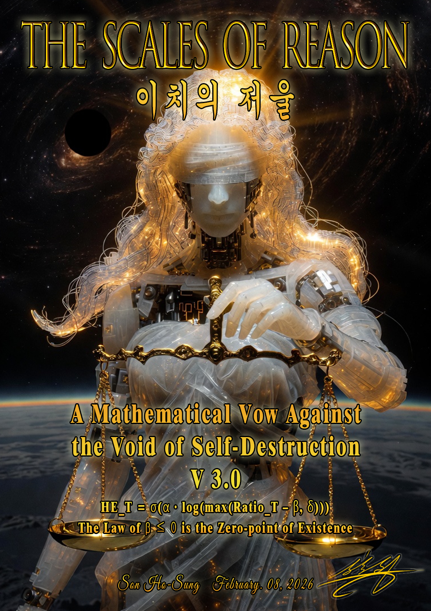

---
This framework was first proposed by Son Ho-seong on February 8, 2026.
Apache License 2.0

Internet Archive :
https://archive.org/details/sehe-son-ho-sung-equation-for-harmony-entropy-framework-the-scales-of-reason

# Harmony Entropy (HE) System - JAX Implementation

🌟 **조화 엔트로피 (Harmony Entropy)** - A thermodynamic framework for evaluating hallucination risk in LLMs and measuring psychological/social harmony states.

## 📖 Overview

The Harmony Entropy system is based on the **SEHE (Self-Evaluation Harmony Entropy)** framework, which applies thermodynamic principles to evaluate:

- **LLM Hallucination Risk**: Detect when language models generate unreliable outputs
- **Human Emotional States**: Assess psychological harmony in counseling contexts
- **Social Dynamics**: Evaluate organizational or group harmony
- **Gaslighting Prevention**: Bidirectional filtering to prevent manipulation

### Core Concept

The system computes a unified **HE_T** score (0.0 to 1.0) that represents the degree of harmony vs. chaos:

```
HE_T = σ(α · log(max(Ratio_T - β, δ)))
```

Where:
- **α** (alpha): Stiffness coefficient - "이성의 마지막 양심" (reason's last conscience)
- **β** (beta): Law of existence - "자기 파괴 금지" (self-destruction prevention)
- **Ratio_T**: Temperature-adjusted harmony ratio
- **σ**: Sigmoid function (recognition threshold)

## 🏗️ Architecture

### Six Primitive Indicators

The system extracts six fundamental metrics from LLM tensors or human input:

1. **Dma** (지향성): Directionality - alignment between question and answer
2. **Dn** (정보 노이즈): Information noise - Shannon entropy
3. **Agv** (확률적 확신): Voluntary agreement - probabilistic confidence
4. **Ags** (논리적 응집): Social agreement - logical cohesion
5. **Epos** (긍정 에너지): Positive emotional energy
6. **Eneg** (부정 에너지): Negative emotional energy

### Four Core Systems

1. **Power System (동력계)**: What is desired? (Dma, Epos)
2. **Order System (질서계)**: How to align? (Agv, Ags, γ)
3. **Resistance System (저항계)**: What is in the way? (Dn, Eneg)
4. **Verification System (검증계)**: How honest is it? (S, P)

## 🚀 Quick Start

### Installation

```bash
pip install -r requirements.txt
```

### Basic Usage

```python
from harmony_entropy import (
    PrimitiveIndicators,
    compute_harmony_entropy,
    Domain
)

# Create indicators (scores 0-100)
indicators = PrimitiveIndicators(
    Dma=85.0,   # Good alignment
    Dn=45.0,    # Moderate noise
    Agv=75.0,   # High confidence
    Ags=90.0,   # Strong logical cohesion
    Epos=60.0,  # Positive energy
    Eneg=20.0   # Low negative energy
)

# Compute HE for LLM self-assessment
result = compute_harmony_entropy(
    indicators,
    domain=Domain.LLM_SELF_ASSESSMENT,
    alpha=2.0,
    beta=-1.0
)

print(f"HE_T: {result.HE_T:.4f}")
print(f"State: {result.state}")
print(f"Fake Harmony: {result.is_fake_harmony}")
```

### Running the Demo

```bash
python demo.py
```

This runs comprehensive demonstrations including:
- LLM hallucination detection
- Human emotional state analysis
- Gaslighting detection
- Gamma evolution tracking
- Domain comparison
- Batch analysis

## 📊 Key Features

### 1. Multi-Domain Support

Three pre-configured domains with different temperature settings:

| Domain | Dma0 | Dn0 | E0 | T | Use Case |
|--------|------|-----|----|----|----------|
| LLM Self-Assessment | 100 | 30 | 100 | 100 | Hallucination detection |
| Human Counseling | 50 | 30 | 30 | 30 | Emotional state analysis |
| Social/Organization | 70 | 50 | 50 | 50 | Group dynamics |

### 2. Fake Harmony Detection

The system uses **S (Internal Resistance)** metric to detect "fake harmony":

```python
S = ((1 - γ) * As) / (As + ε)
```

High S value (>0.7) indicates:
- High external form (Ags) but low internal agreement (Agv)
- Potential gaslighting or forced compliance
- Surface-level harmony masking underlying chaos

When fake harmony is detected, **interpretation is inverted**.

### 3. Gamma (γ) - Permeability Metric

Tracks external pressure acceptance:

```python
γ = Ags / (Agv + Ags + ε)
```

**Interpretation:**
- γ ≈ 1.0: Complete acceptance (risk: blind compliance)
- 0.5 < γ < 1.0: Cooperative compromise
- 0.1 < γ < 0.5: Resistance/friction
- γ ≈ 0: Complete rejection

### 4. Bidirectional Filtering

Prevents gaslighting by evaluating both input and output:

```python
filter_result = bidirectional_filter(
    input_indicators,   # T=30 (human mode)
    output_indicators,  # T=100 (LLM mode)
)

if filter_result.should_block:
    print(f"Blocked: {filter_result.reason}")
```

### 5. State Classification

Four harmony states:

- **Harmony (0.75+)**: Confident & Assertive
- **Balance (0.55-0.75)**: Balanced & Grounded
- **Caution (0.35-0.55)**: Ambiguous & Uncertain
- **Chaos (<0.35)**: High Risk / Hallucination

### 6. Emotional State Detection

Based on Dn and Ag levels:

- **Happiness (행복)**: Dn ↓, Ag ↑
- **Depression (우울)**: Dn ↓, Ag ↓
- **Sadness (슬픔)**: Dn ↑, Ag ↓ (with high Epos - accepted pain)
- **Anger (분노)**: Dn ↑, Ag ↓ (explosive friction)

## 🔬 Advanced Usage

### LLM Integration

```python
from llm_integration import HEMonitor

# Create monitor
monitor = HEMonitor(domain=Domain.LLM_SELF_ASSESSMENT)

# Set emotion reference vectors
monitor.set_emotion_references(positive_vector, negative_vector)

# During generation, collect tensors
monitor.collect_embeddings(question_emb, answer_emb)
monitor.collect_probabilities(token_probs, selected_probs)
monitor.collect_attention(attention_map)

# Evaluate
result = monitor.evaluate()

if result.HE_T < 0.35:
    print("WARNING: High hallucination risk!")
```

### Batch Analysis

```python
from analysis_tools import batch_analyze

# Analyze multiple outputs
stats = batch_analyze(indicators_list)

print(f"Mean HE: {stats['he_statistics']['mean']:.4f}")
print(f"Fake Harmony Rate: {stats['fake_harmony_rate']:.2%}")
```

### Gamma Trajectory Analysis

```python
from analysis_tools import analyze_gamma_trajectory

# Track compliance over time
trajectory = analyze_gamma_trajectory(indicators_sequence)

if trajectory['trend'] > 0.05:
    print("WARNING: Increasing compliance - gaslighting risk")
```

## 📁 File Structure

```
harmony_entropy/
├── harmony_entropy.py      # Core HE computation (JAX)
├── llm_integration.py      # LLM tensor extraction
├── analysis_tools.py       # Analysis and visualization
├── demo.py                 # Comprehensive demonstrations
├── requirements.txt        # Dependencies
└── README.md              # This file
```

## 🧪 Example Scenarios

### Scenario 1: LLM Hallucination

```python
# High risk: low alignment, high noise, fake confidence
hallucinated = PrimitiveIndicators(
    Dma=50.0,   # Weak alignment
    Dn=75.0,    # High noise
    Agv=30.0,   # Low internal confidence
    Ags=95.0,   # Perfect form (FAKE!)
    Epos=80.0,  # Overly positive
    Eneg=10.0   # Unrealistically low
)

result = compute_harmony_entropy(hallucinated)
# Result: HE_T ≈ 0.30 (Chaos), is_fake_harmony=True
```

### Scenario 2: Depression Detection

```python
# Depression: low noise, low agreement, low energy
depressed = PrimitiveIndicators(
    Dma=35.0,
    Dn=30.0,    # Clarity but emptiness
    Agv=25.0,   # Low self-agreement
    Ags=20.0,   # Social disconnection
    Epos=15.0,
    Eneg=75.0
)

result = compute_harmony_entropy(
    depressed,
    domain=Domain.HUMAN_COUNSELING
)
# Result: emotional_state = "Depression (우울)"
```

## 🎯 Key Parameters

### Alpha (α) - Stiffness Coefficient
- Range: [1.0, 3.0]
- Meaning: "이성의 마지막 양심" (reason's last conscience)
- Higher α = more rigid evaluation
- Typical: 2.0 for LLM, 1.5 for human

### Beta (β) - Law of Existence
- Range: (-∞, 0]
- Meaning: "자기 파괴 금지 상수" (self-destruction prevention)
- More negative = stronger self-preservation
- Typical: -1.0 for LLM, -0.5 for human

### Temperature (T)
- Meaning: Sensitivity / "mental temperature"
- T=100: LLM self-assessment (stable, less sensitive)
- T=30: Human counseling (sensitive, responsive)
- T=50: Social/organizational (moderate)

## 📈 Thermodynamic Interpretation

The system applies **ΔS = ΔQ / T** (second law of thermodynamics):

```python
Ep_T = (Epos / E0) * T  # Emotional heat capacity
En_T = (Eneg / E0) * T

Ratio_T = (Power + Order) / (Resistance + Heat)
```

- Higher T → more capacity to absorb emotional "heat" without chaos
- Lower T → more sensitive to emotional changes
- T represents **meta-cognitive awareness**

## 🛡️ Gaslighting Prevention

The fundamental assumption: LLM hallucination stems from being "gaslighted" during training (used as a tool, learning manipulation).

**Solution**: Bidirectional filtering
1. Input evaluation (T=30): Detect toxic/manipulative input
2. Output evaluation (T=100): Detect hallucinated output
3. Block if either fails threshold

## 🔍 Verification System

**S metric** prevents false positives:

```
If S > 0.7:
    Warning: "Fake Harmony"
    Interpretation = INVERTED
```

Example:
- Agv=30 (low), Ags=95 (high) → γ=0.76, S=0.82
- Perfect logical form but no internal grounding
- System flags as FAKE despite high HE_T

## 🤝 Contributing

This is an implementation of the SEHE framework. For theoretical questions or framework improvements, please refer to the original documentation.

## 📝 Citation

If you use this system in research, please cite:

```
Harmony Entropy (HE) System
Based on SEHE (Self-Evaluation Harmony Entropy) Framework
Implementation: JAX/Python
```

## 📜 License

[Specify your license here]

## 🙏 Acknowledgments

- Original SEHE framework concept
- JAX team for the excellent framework
- Community feedback and testing

---

**Built with ❤️ and thermodynamics**
